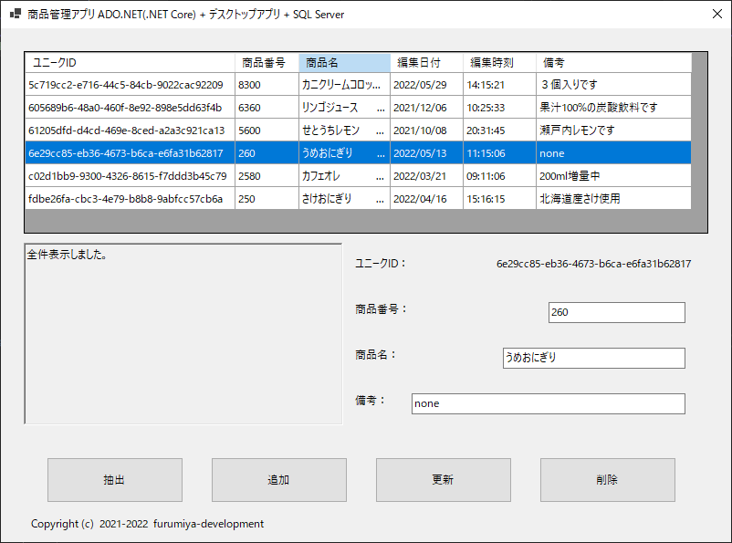

## :computer: Windows Formsで.NET Data Providerを使いSQLServerとの読み書きサンプル  
___
## 開発環境
```
統合開発環境：Microsoft Visual Studio 2022 Community Edition 17.4.1  
言語：C# 10.0  
デスクトップ：Windows Formsアプリケーション
フレームワーク：.NET 6.0.11  
デベロッパーSDK：.NET SDK 6.0.403  
データベース：Microsoft SQLServer 2022 Express RTM  
-データベース管理ツール：Microsoft SQL Server Management Studio 18.12.1
データベース接続：.NET Framework Data Provider for SQL Server  
NuGetパッケージ：Install-Package Microsoft.Data.SqlClient -Version 5.0.1  
```

  

**テーブル作成**  
```
use [master]
create table [AdoNetSample].[dbo].[shohins] (
	unique_id char(36) NOT NULL,	        /*自動連番*/
	shohin_code int NOT NULL,		        /*商品番号*/
	shohin_name char(50),				    /*商品名*/
	updated_on decimal(8,0) NOT NULL,		/*編集日付*/
	updated_at decimal(6,0) NOT NULL,		/*編集時刻*/
	remarks varchar(255),					/*備考*/
	primary key (unique_id))
```

```